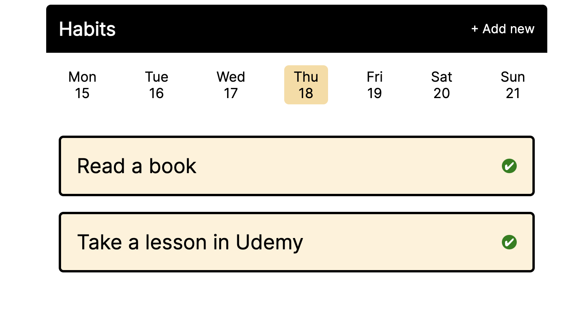

# Habit Tracker

### App made in Flask to track your daily routine.


---
### Run the app
1. Deploy a mongodb database and replace the parameters in .env file
2. Create a virtual environment and install dependencies
```bash
$ python -m venv .venv
$ source .venv/bin/activate
$ pip install -r requirements.txt
```
3. Run in the command line
```bash
$ flask run 
```